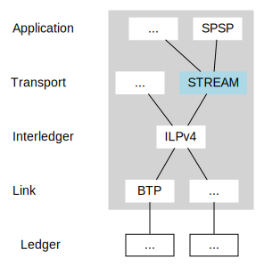
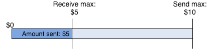

# Overview

This document describes the JavaScript implementation of Interledger's STREAM transport protocol.

[](https://npmjs.org/package/ilp-protocol-stream)
[](https://standardjs.com)

## References

- [STREAM RFC](https://interledger.org/rfcs/0029-stream/)
- [Interledger protocol suite](https://interledger.org/overview.html)
- API docs:
  - [Connection](https://interledgerjs.github.io/ilp-protocol-stream/modules/_connection_.html) - Manages the communication between a client and a server
  - [Index](https://interledgerjs.github.io/ilp-protocol-stream/modules/_index_.html) - Creates a connection to a server
  - [Stream](https://interledgerjs.github.io/ilp-protocol-stream/modules/_stream_.html) - Sends/receives data and money

# Table of Contents

- [Overview](#overview)
  - [References](#references)
- [STREAM protocol overview](#stream-protocol-overview)
- [STREAM connections](#stream-connections)
  - [Open a STREAM connection](#open-a-stream-connection)
- [Streams](#streams)
- [Install the STREAM module](#install-the-stream-module)
  - [Dependencies](#dependencies)
- [Usage examples](#usage-examples)
  - [Exchange destination address and shared secret](#exchange-destination-address-and-shared-secret)
  - [Create a STREAM connection](#create-a-stream-connection)
  - [Send and receive on streams](#send-and-receive-on-streams)
  - [Stream multiple payments on a single connection](#stream-multiple-payments-on-a-single-connection)
  - [Stream data](#stream-data)
  - [Stream expiry](#stream-expiry)
  - [Close a stream](#close-a-stream)
  - [Close a connection](#close-a-connection)
  - [How a receiving wallet can use the STREAM server](#how-a-receiving-wallet-can-use-the-stream-server)
  - [Configure the STREAM library as a sender for Web Monetization](#configure-the-stream-library-as-a-sender-for-web-monetization)
- [How STREAM handles assets](#how-stream-handles-assets)
  - [Connectors](#connectors)
  - [Determine an exchange rate (optional)](#determine-an-exchange-rate--optional-)
- [STREAM receipts](#stream-receipts)

# STREAM protocol overview

STREAM stands for Streaming Transport for the Real-time Exchange of Assets and Messages. It’s a transport-layer protocol that's used to send packets of money and data through the Interledger network, rather than over the internet.



STREAM is designed for use by applications that stream micropayments and those that deliver larger, discrete payments. It's responsible for:

- Defining the conditions and fulfillments used in the Interledger protocol layer
- Grouping and retrying packets to achieve a desired outcome
- Determining the effective exchange rate of a payment
- Adapting to the speed at which money can be sent, and for what amounts (congestion and flow control)
- Encrypting and decrypting data

# STREAM connections

A STREAM connection is a session established between two endpoints (a client and a server). Since STREAM is an Interledger protocol, the connection occurs over the Interledger network, not the internet.

A single connection can support multiple streams, which are logical, bidirectional channels over which money and data are sent and received.

## Open a STREAM connection

Before establishing a STREAM connection, the client must request and receive a destination ILP address and shared secret from the server. This exchange is not handled by the STREAM protocol. It must be handled by a higher-level protocol and/or out-of-band authenticated communication channel. The Simple Payment Setup Protocol (SPSP) is an Interledger application-layer protocol that can be used for this purpose.

When the client receives the destination address and shared secret, it passes the credentials to its STREAM client module. The module then initiates a STREAM connection to the server over the Interledger network.

### STREAM and SPSP servers

STREAM and SPSP are separate entities though they often run in the same process. This is because the STREAM server that handles incoming funds must use the shared secret that was generated by the SPSP server's `generateAddressAndSecret` call.

While SPSP uses HTTPS to communicate the destination address and shared secret to the client, STREAM does **not** create the connection over the internet. The connection is created over the Interledger network.

Creating one STREAM server object through the protocol-stream library and using the object for both the STREAM and SPSP servers simply saves you some work. They are often put together in flow diagrams because that's how they are most commonly implemented.

# Streams

A stream is a logical channel on which money and data is sent and received over a STREAM connection. A single connection, using a single shared secret, can support multiple streams.

Either endpoint (client or server) can open a new stream. Multiple streams can deliver smaller payments on an ongoing basis or a single stream can deliver one large, discreet payment.

# Install the STREAM module

Install the `ilp-protocol-stream` module into your Node.js project. You must be running Node 10 or greater. You need the module if you intend to develop a client or run a server that supports Interledger.

```
$ npm install ilp-protocol-stream
```

Also, `ilp-protocol-stream` will run in a browser via webpack, but only as a client.

## Dependencies

The `ilp-protocol-stream` module is bundled with a set of dependencies.

- Bundle dependencies
  - ilp-logger - Debug logging utility for Interledger modules
  - ilp-packet - Codecs for ILP packets and messages
  - ilp-protocol-ildcp - Transfers node and ledger information from a parent node to a child node
- Development dependencies
  - ilp-plugin - Gets ILP credentials
  - ilp-plugin-btp - Acts as a building block for plugins that don't have an underlying ledger

# Usage examples

## Exchange destination address and shared secret

### Server

The server must generate a destination account address and shared secret for each client, then pass the information to the client through an authenticated communication channel.

```js
const { createServer } = require('ilp-protocol-stream')
const Plugin = require('ilp-plugin-btp')

// Connects to the given plugin and waits for streams.
async function run() {
  const server = await createServer({
    plugin: new Plugin({ server: process.env.BTP_SERVER }),
  })

  const { destinationAccount, sharedSecret } = server.generateAddressAndSecret()
}
```

### Client

After the server provides the destination account and shared secret, the client can create a STREAM connection to the server.

```js
const { createConnection } = require('ilp-protocol-stream')
const getPlugin = require('ilp-plugin-btp')

const { destinationAccount, sharedSecret } = providedByTheServerSomehow()

async function run() {
  const connection = await createConnection({
    plugin: new Plugin({ server: process.env.BTP_SERVER }),
    destinationAccount,
    sharedSecret,
  })
}
```

## Create a STREAM connection

### Server

The server listens for an incoming STREAM connection from the client.

```js
server.on('connection', connection => { ...
```

### Client

The client creates a STREAM connection to the server.

```js
const connection = await createConnection({
  plugin: new Plugin({ server: process.env.BTP_SERVER }),
  destinationAccount,
  sharedSecret,
})
```

After the connection is opened between the client and server, the connection is ready to support streams. A single connection, using a single shared secret, can support multiple streams.

## Send and receive on streams

Streams are bidirectional, meaning both endpoints can send and receive on a stream. Each stream is its own object that emits events when money comes in or goes out.

Streams returned by `connection.createStream`, or produced by the `stream` event on a STREAM server, expose the Node.js [Stream API](https://interledgerjs.github.io/ilp-protocol-stream/modules/_stream_.html) for sending data. They also expose functions for sending and receiving money.

Payments are sent and received using `setSendMax` and `setReceiveMax`. `setSendMax` and `setReceiveMax` set the maximum amount an individual stream can send and receive, thereby enforcing sending and receiving limits. These calls occur instantly, before any funds are sent or received.

The amounts given for both functions are denominated in the connection plugin’s units. This amount is absolute, not relative. For example, calling `setSendMax(100)` twice on a single stream only allows the stream to send 100 units.

When used with event listeners, these calls can supply you with a high level of detail by providing events for each individual micropayment.

### Set a send max and send a stream

`setSendMax` sets the maximum amount an individual stream can send, thereby enforcing a sending limit. This call occurs instantly, before any funds are sent.

A payment is automatically triggered when the `setSendMax` value is more than the amount already sent. As an example, micropayments in Web Monetization would be a single stream. A `setSendMax` would be called on some time interval where each time it’s called, it’s called with a higher amount.

The stream will always attempt to send up to its defined max, but ultimately will only send as much as the receiver is willing to receive. If the receiver has set a `receiveMax`, then the amount is adjusted by the exchange rate.


```js
stream.on('outgoing_money', (amount) => {
  console.log('sent', amount)
})

stream.setSendMax(100)
```

In the following scenario, the receiver isn’t willing to receive the whole amount, but some money still moves. The sender will send as much as they can.

#### Sender

```js
stream.on('outgoing_money', (amount) => {
  console.log('sent', amount)
})
stream.setSendMax(100)
```

#### Receiver

```js
server.on('connection', (connection) => {
  connection.on('stream', (stream) => {
    stream.setReceiveMax(75)
    stream.on('money', (amount) => {
      console.log(`got money: ${amount} on stream ${stream.id}`)
    })
    stream.on('end', () => {
      console.log('stream closed')
    })
  })
})
```

### Set a receive max and receive a stream

`setReceiveMax` sets the maximum amount an individual stream can receive, thereby enforcing a receiving limit. This call occurs instantly, before any funds are received.

Payments are automatically received when the `setReceiveMax` value is more than the amount already received.

The stream will always attempt to receive up to its defined max. If the sender has set a `sendMax`, then the amount is adjusted by the exchange rate.



To receive a stream, the server listens for a `connection` event.

Since each connection can include many separate streams of money and data, the connection then listens for `stream` events.

```js
server.on('connection', (connection) => {
  connection.on('stream', (stream) => {
    stream.setReceiveMax(10000)
    stream.on('money', (amount) => {
      console.log(`got money: ${amount} on stream ${stream.id}`)
    })
  })
})
```

> The `stream.id` is handled by the STREAM library in the background. Server-initiated streams are assigned an even number. Client-initiated streams are assigned an odd number.

## Stream multiple payments on a single connection

Micropayments are sent and received the same way as a single payment, except that multiple streams are created and closed.

### Client

```js
const stream = connection.createStream()
stream.setSendMax(10)

const stream2 = connection.createStream()
stream2.setSendMax(25)
```

### Server

```js
server.on('connection', (connection) => {
  connection.on('stream', (stream) => {
    stream.setReceiveMax(10000)

    stream.on('money', (amount) => {
      console.log(`got money: ${amount} on stream ${stream.id}`)
    })

    stream.on('end', () => {
      console.log('stream closed')
    })
  })
})
```

## Stream data

You can stream data using the same interface as the Node.js Stream API.

### Send data

```js
const stream = connection.createStream()
stream.write('hello\n')
stream.write('here is some more data')
stream.end()
```

### Receive data

```js
stream.on('data', (chunk) => {
  console.log(`got data on stream ${stream.id}: ${chunk.toString('utf8')}`)
})
```

> The `stream.id` is handled by the STREAM library in the background. Server-initiated streams are assigned an even number. Client-initiated streams are assigned an odd number.

## Stream expiry

The sender calls the `getExpiry` function for each packet or sets the expiry to the current date/time plus 30 seconds if `getExpiry` is not provided.

For example, if a packet is created on May 26, 2020 at 8:15:00 am, US Eastern Standard Time, then the expiry is set to 2020-05-26T13:30:300Z by default.

The intermediaries between the sender and receiver forward the packet as long as the packet is not about to expire in <1s.

## Close a stream

Either endpoint can close a stream. Streams can close due to errors, expirations, and completions.

```js
stream.end()
```

To log the `end` event:

```js
stream.on('end', () => {
  console.log('stream closed')
})
```

To force a stream to close immediately without waiting for pending money and data to be sent, use the `destroy` method.

```js
stream.destroy()
```

## Close a connection

Either endpoint can close a connection. When a connection is closed, all streams are closed as well. Connections can close due to errors and completions.

```js
connection.end()
```

A closed connection can’t be reused. A new connection must be created with a new shared secret and destination address.

To log the `end` event:

```js
connection.on('end', () => {
  console.log('1: The connection closed normally')
})
```

To force a connection to close immediately without waiting for pending money and data to be sent, use the `destroy` method.

```js
connection.destroy()
```

## How a receiving wallet can use the STREAM server

This section describes how a wallet that only receives incoming payments (it doesn’t send outbound payments) could use the STREAM server and the security and development considerations related to that.

At a high level, the STREAM server:

1. Binds the `connection` event.
2. Might perform some **non-async** setup.
   > A common pitfall is for an asynchronous operation to happen between the `connection` event and binding the stream (in the next step), causing the server to miss when the stream opens.
3. Binds the `stream` event.
4. Might perform more **non-async** setup.
5. Sets the `setReceiveMax` to allow incoming funds.
6. Binds the `money` event.
7. Dispatches something to the database or some kind of store whenever a `money` event triggers.

```js
streamServer.on('connection', (connection) => {
  const metadata = JSON.parse(this.connectionTag.decode(connection.connectionTag))
  connection.on('stream', (stream) => {
    stream.setReceiveMax(Infinity)
    stream.on('money', (amount) => {
      console.log('received money', amount)
    })
  })
})
```

## Configure the STREAM library as a sender for Web Monetization

This section provides some best practices for configuring the STREAM library as a sender for Web Monetization. In this scenario, bidirectional communication isn’t necessary. The sender repeatedly sends money to the receiver, but does not expect money or data in return.

This section assumes you have an ILP uplink, meaning you have a peer and an arrangement for settlement, or you connect to a system that performs settlements for you and acts as the source of truth.

All STREAM payments for a Web Monetized page visit must happen over a single stream.

### Best practices

#### Expiration due to clock skew

When initializing the sender connection (`createConnection`), pass in a `getExpiry` function that returns a far-future expiry (`FAR_FUTURE_EXPIRY`). This ensures that packets won’t unexpectedly expire if the user’s OS clock is skewed. The next connector will reduce the expiry before passing it on, preventing packets from hanging forever.

#### Slippage

Senders should set `slippage: 1.0`.

Exchange rates are irrelevant to Web Monetization because there’s no target amount that the sender is trying to get to the receiver.

If you **do** need to consider exchange rates, you can verify that the connection’s rate is acceptable by calling `connection.minimumAcceptableExchangeRate` before sending any money.

### Web Monetization lifecycle

1. The sender opens a connection using `create.Connection`.
2. The sender opens a stream using `connection.createStream`.
3. The sender begins paying using `stream.setSendMax(cumulativeAmountToSend)`.
   > The sender’s `stream.on(‘outgoing_money’)` event emits every time money is successfully delivered to the recipient.
4. After some time passes, the sender can increase the `setSendMax` according to their application’s requirements.

If any step fails, or the connection dies, terminate whatever is left of the connection and plugin and start over. Keep track of how much was sent on the old connection with `connection.totalSent` or `connection.totalDelivered`.

### Example

The following source file is part of the Coil Extension. Lines 303 - 493 can be used as a starting point for configuring the STREAM library as a sender: https://github.com/coilhq/web-monetization-projects/blob/master/packages/coil-extension/src/background/services/Stream.ts#L303-L493

# How STREAM handles assets

An asset is comprised three parts:

- Amount - The quantity of the asset expressed as an integer greater than or equal to zero
- Asset code - A code, typically three characters, that identifies the amount's unit (e.g., USD, XRP, EUR, BTC)
- Asset scale - The number of places past the decimal for the amount

For example:

```js
amount: "7567",
assetCode: "USD",
assetScale: 2
```

We have an amount of 7567 that's denominated in US dollars. Since the asset scale is 2, it means that we're working with $75.67. If the asset scale was 3, then we'd have $7.567 (~$7.57), and so on.

In the next example, the amount is 1,000,000,000. Since the scale is 9, we're working with 1 XRP.

```js
amount: "1000000000",
assetCode: "XRP",
assetScale: 9
```

The sender can send a currency that’s different from what the receiver wants to receive. As the Stream API communicates sender and receiver currency details, one or more intermediaries on the Interledger network convert the currency automatically. Connectors are one type of intermediary that can perform currency conversions.

## Connectors

One example of an intermediary is a connector. A connector is a node between a sender and receiver that receives streams, performs currency conversions, then forwards the stream with the revised amount to the next node. Each connector has a direct peering relationship with other nodes. Each peering relationship has a single currency associated with it. The next node to receive a stream could be another connector, if additional conversions are needed, or the destination. Connectors themselves might generate revenue from spreads on currency conversion, through subscription fees, or other means.

## Determine an exchange rate (optional)

A stream’s exchange rate can be determined experimentally by sending test packets to the destination. The destination responds with the amount they received in the stream. That rate can be used as a baseline for how much the sender can expect to be delivered.

# STREAM receipts

STREAM receipts can be generated by the receiver to serve as proof of the total amount received on streams. In Web Monetization, for example, receipts allow you to verify payments before securely serving exclusive content.

Standardized receipt functionality at the STREAM layer enables the payment to be verified without needing to access the corresponding Interledger packets. This verification is typically handled by a third-party verifier.

At a high-level, STREAM receipts work as follows:

1. A receipt secret and receipt nonce are communicated to the receiver by a verifier over some channel, such as SPSP. These parameters are used to generate connection details, which are required before the STREAM connection can be established.
2. After a STREAM connection is established and the sender is sending, the receiver returns a STREAM receipt to the sender each time a packet is sent, indicating the total amount of money received in each stream.
3. The receipts returned by the receiver are exposed by the STREAM client on `stream.receipt`. The receipts may be submitted directly or indirectly to the verifier.
4. Each receipt on a stream contains a progressively higher amount, representing the total amount received on the stream. This means the latest receipt on a stream replaces any previous receipts on that stream.

For more information, see the [STREAM Receipts RFC](https://interledger.org/rfcs/0039-stream-receipts/).
